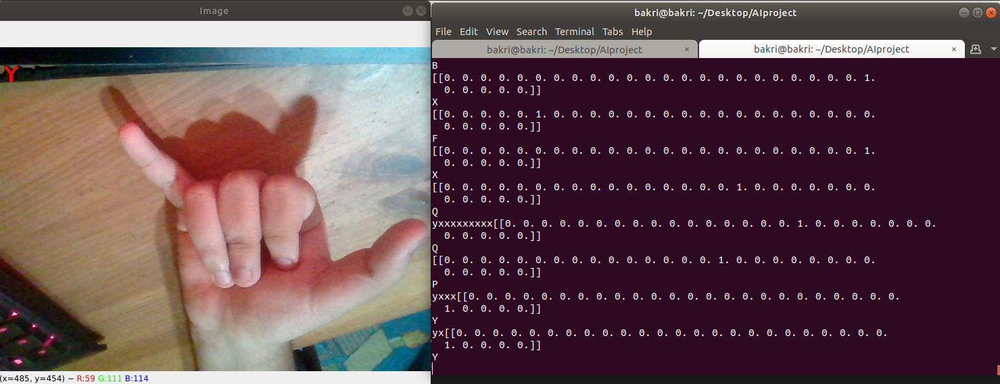

# OPENCV implementation
This code uses openCV to test out the code using your camera.

---
## To start
First make sure the `implementationcode.py` is made executable.

Once training is done, move the `h5` file that has been outputted by the training in this directory,
and run the code using

`python3.9 implementationcode.py`

---
## How to use
