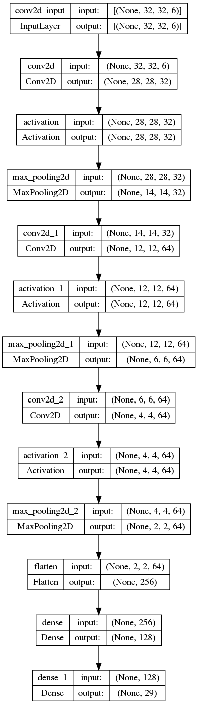
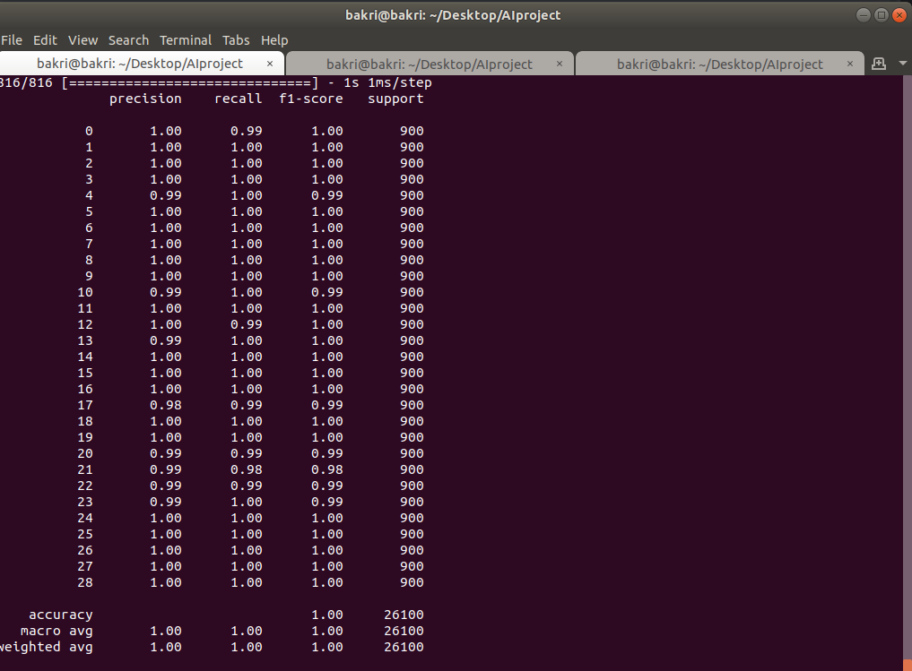
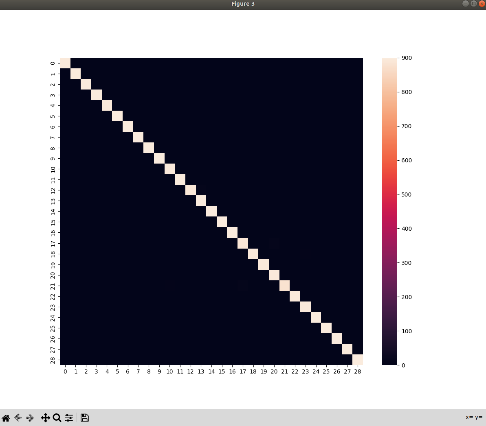

# Model
To start, ensure that 'model.py' is executable, and run

`python3.9 model.py` to start training (This will take a while, I suggest playing around with EPOCHS and image size)

---
## Model Architecture

---
## Expected output

### Accuracies/Evaluation Metrics

### Confusion matrix heatmap

---
## Adding the dataset

Head into the `dataset` directory, and add the installed asl_
